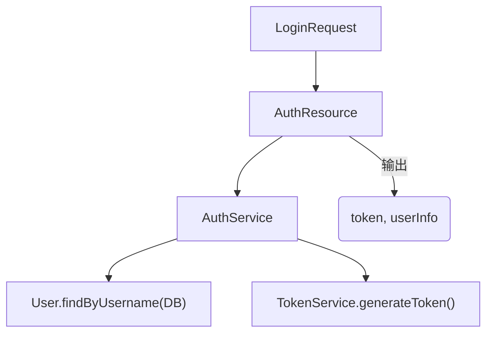
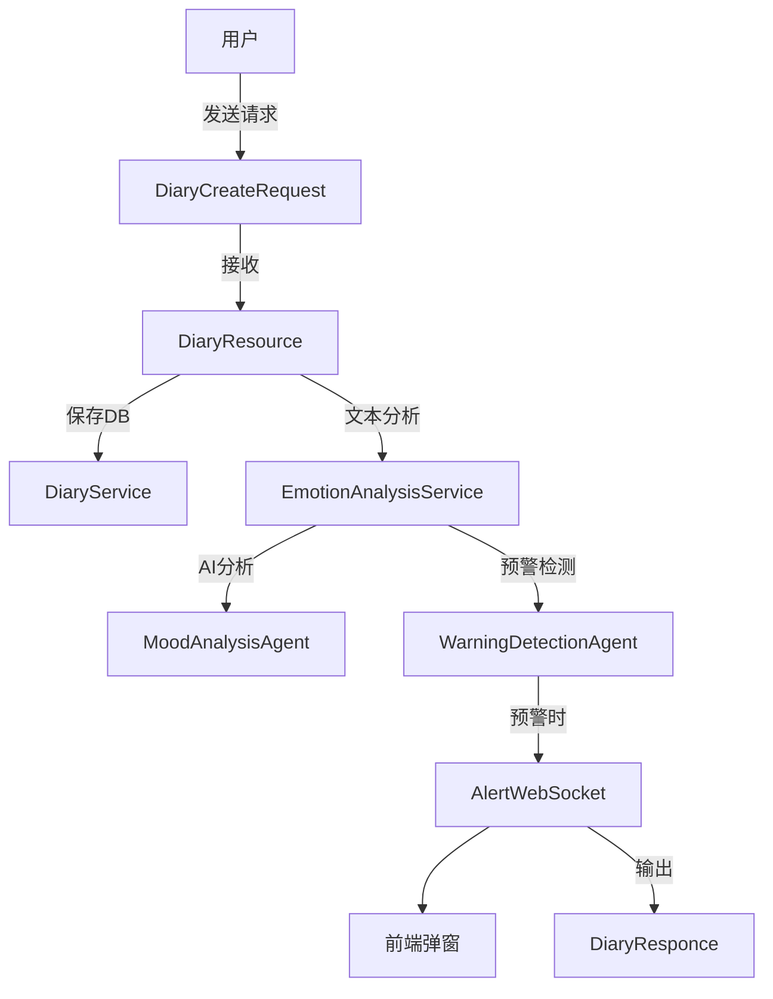
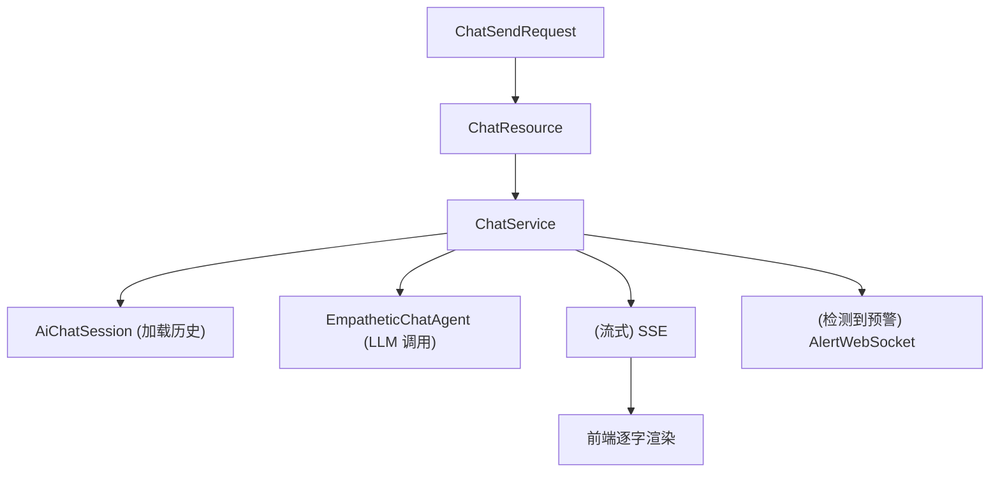
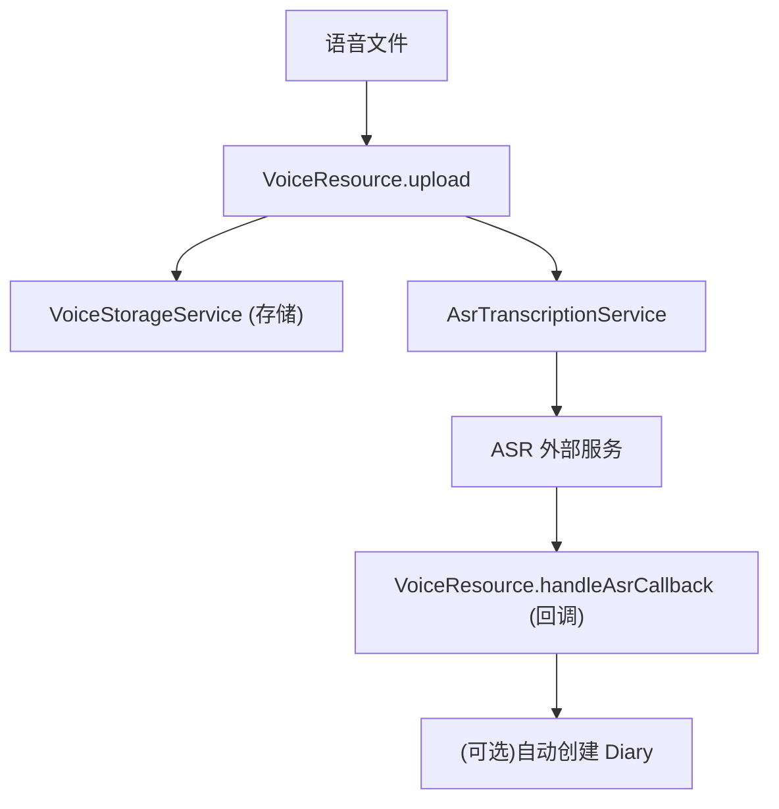
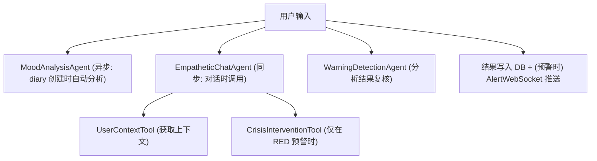

# Soul Notes 后端早期架构落地设计

> **状态**: v2.0 — P1 核心链路已完成, P2 AI 接入文件已实现, 待进入 P2 共情对话/P3 语音模块.
> **本文件落地 `DEV.md` 中的后端骨架, 细化至每个文件的具体职责、关键方法、数据流向.**
> **✓ = 已实现, ✗ = 未实现 (标注计划阶段)**

---

## 总览: 包结构全景

```text
kurvcygnus.soulnotes/
├── Entrance.java                         # 应用入口 ✓
├── config/                               # 全局配置 ✓
│   ├── JwtConfig.java                    # JWT 密钥/过期配置 ✓
│   ├── CorsConfig.java                   # CORS 跨域配置 ✓
│   ├── AiModelConfig.java                # LangChain4j 模型/端点配置 ✓
│   └── RedisConfig.java                  # Redis 连接与序列化配置 ✓
├── utils/                                # 常量、枚举、静态辅助
│   ├── enums/
│   │   ├── UserRole.java                 # STUDENT / COUNSELOR / ADMIN ✓
│   │   ├── EmotionWeatherType.java       # SUNNY / CLOUDY / OVERCAST / RAINY / THUNDERSTORM ✓
│   │   └── WarningLevel.java             # NONE / YELLOW / RED ✓
│   ├── constants/                        # 常量 ✓
│   │   ├── JwtConstants.java             # JWT 常量 ✓
│   │   ├── AiPromptConstants.java        # AI 提示词模板 (占位) ✓
│   │   ├── RedisKeyConstants.java        # Redis Key 模式 ✓
│   │   └── ApiEndpointConstants.java     # REST 路径常量 ✓
│   ├── lint/
│   │   └── CallerSensitive.java          # 调用者敏感标记注解 ✓
│   ├── JsonUtils.java                    # Jackson 统一 ObjectMapper 封装 ✓
│   ├── TimeUtils.java                    # 时区/日期辅助 ✓ (已实现 2026-07-15)
│   └── PrintUtils.java                   # 日志/字符串相关辅助方法 ✓
├── exception/                            # 全局异常处理 & 结构化异常体系
│   ├── IStructuredThrowable.java         # 异常体系基础接口: tag() + cause() ✓ (迁移自 CS)
│   ├── StructuredException.java          # 具体结构化运行时异常(默认实现) ✓ (迁移自 CS)
│   ├── IDetailedThrowable.java           # 携带类型化详细数据的异常接口 ✓ (迁移自 CS)
│   ├── ITransactionalThrowable.java      # 可回滚/可恢复的结构化异常 ✓ (迁移自 CS)
│   ├── IBusinessException.java           # 业务异常门面接口 + HolderException + DataHolderException (同文件内包级私有实现) ✓ (2026-07 新增)
│   ├── ErrorCode.java                    # 枚举: 统一错误码体系 ✓
│   ├── GlobalExceptionMapper.java        # 响应式全局异常映射器 ✓ (已实现 2026-07-15)
│   └── ValidationExceptionMapper.java    # 请求参数校验异常映射 ✓ (已实现 2026-07-15)
├── dto/                                  # 全局共享 DTO (跨模块复用)
│   ├── ApiResponse.java                  # 统一 JSON 响应外壳 {code, message, data} ✓
│   └── PageRequest.java                  # 分页查询通用参数 (含边界 clamp) ✓
├── domain/                               # 核心业务模块
│   ├── auth/                             # 认证模块 ✓
│   │   ├── entity/
│   │   │   └── User.java                 # 用户实体 (Panache 响应式)
│   │   ├── dto/
│   │   │   ├── LoginRequest.java         # 登录请求体
│   │   │   ├── RegisterRequest.java      # 注册请求体
│   │   │   └── AuthResponse.java         # {token, userInfo} 响应
│   │   ├── resource/
│   │   │   └── AuthResource.java         # POST /auth/login, POST /auth/register
│   │   ├── service/
│   │   │   ├── AuthService.java          # 注册/登录/SHA-256 密码加密校验逻辑
│   │   │   └── TokenService.java         # JWT 签发与校验
│   │   └── security/
│   │       ├── JwtAuthenticationMechanism.java  # Quarkus 安全认证机制实现
│   │       └── Roles.java                       # 角色常量 (已废弃, 由 UserRole 替代)
│   │
│   ├── diary/                            # 情绪日记模块 ✓
│   │   ├── entity/
│   │   │   └── MoodDiary.java            # 情绪日记实体 (JSONB analysis_result)
│   │   ├── dto/
│   │   │   ├── DiaryCreateRequest.java   # 创建日记请求
│   │   │   ├── DiaryResponse.java        # 日记响应(含分析结果)
│   │   │   ├── EmotionWeatherVo.java     # 情绪天气预报 VO
│   │   │   └── DiaryListQuery.java       # 日记列表查询参数 (含边界 clamp)
│   │   ├── resource/
│   │   │   └── DiaryResource.java        # CRUD /diaries 及 /diaries/weather 等
│   │   └── service/
│   │       ├── DiaryService.java         # 日记增删改查 + 调用 AI 分析 (骨架)
│   │       ├── EmotionAnalysisService.java   # 分析结果落库 + 天气映射 (骨架)
│   │       └── EmotionWeatherService.java    # 按时间聚合生成天气预报 ✓ (含 13 个边界测试)
│   │
│   ├── chat/                            # AI 树洞对话模块 ✓
│   │   ├── entity/
│   │   │   └── AiChatSession.java        # AI 对话 Session (JSONB messages)
│   │   ├── dto/
│   │   │   ├── ChatSendRequest.java      # 发送消息请求
│   │   │   ├── ChatMessageVo.java        # 单条消息 VO
│   │   │   └── ChatSessionVo.java        # 会话概览 VO
│   │   ├── resource/
│   │   │   └── ChatResource.java         # REST + SSE /chat/stream 等
│   │   └── service/
│   │       └── ChatService.java          # 对话历史管理 + 调用 AI Agent (占位)
│   │
│   └── voice/                            # 语音处理模块 ✗ (P3)
│       ├── dto/
│       │   ├── VoiceUploadResponse.java
│       │   └── AsrCallbackRequest.java
│       ├── resource/
│       │   └── VoiceResource.java
│       └── service/
│           ├── VoiceStorageService.java
│           └── AsrTranscriptionService.java
├── ai/                                   # AI 能力封装层 ✓ (P1 核心已完成)
│   ├── agent/
│   │   ├── MoodAnalysisAgent.java        # @RegisterAiService — 情感分析专用 ✓
│   │   ├── EmpatheticChatAgent.java      # @RegisterAiService — 共情对话专用 ✗ (P2)
│   │   └── WarningDetectionAgent.java    # @RegisterAiService — 红线预警检测 ✓
│   ├── dto/
│   │   ├── MoodAnalysisResult.java       # Record: positive, negative, anxiety, weather, summary ✓
│   │   └── WarningDetectionResult.java   # Record: warningLevel, reason, suggestedAction ✓
│   ├── tool/
│   │   ├── CrisisInterventionTool.java   # @Tool — 触发红线时调用, 返回热线信息 ✓
│   │   └── UserContextTool.java          # @Tool — 提供用户上下文给 AI ✗ (P2)
│   └── retriever/
│       └── PsychologyTipsRetriever.java  # (可选) 心理小知识检索增强 ✗ (P4)
└── websocket/                            # WebSocket 控制器 ✗ (P2/P3)
    ├── ChatWebSocket.java                # /ws/chat — AI 对话流式文本推送
    └── AlertWebSocket.java               # /ws/alert — 红色预警实时推送
```

---

## 模块详细设计

---

### 1. `config/` — 全局配置

所有配置类负责读取 `application.properties` 并构造框架所需的 Bean.

| 文件                   | 职责                                   | 关键内容                                                                 | 状态 |
|----------------------|--------------------------------------|----------------------------------------------------------------------|----|
| `JwtConfig.java`     | 读取 JWT 密钥、过期时间                       | `@ConfigProperty("jwt.secret")`, `@ConfigProperty("jwt.expiration")` | ✓  |
| `CorsConfig.java`    | 声明 CORS 允许的来源与方法                     | Quarkus HTTP CORS filter 配置                                          | ✓  |
| `AiModelConfig.java` | 配置 LLM 的 API Key、endpoint、model name | `@ConfigProperty("ai.openai.api-key")` 等                             | ✓  |
| `RedisConfig.java`   | Redis 客户端连接配置                        | 默认通过 `application.properties` 的 `quarkus.redis.*` 即可                 | ✓  |

> 当前状态: 4 个配置类已实现, 读取 `application.properties` 并通过构造器注入暴露配置值.
**数据流向**: 其他模块通过 `@Inject` 或 `@ConfigProperty` 获取配置值.

---

### 2. `utils/` — 常量、枚举、静态辅助

| 文件                                    | 职责           | 关键内容                                                                     |
|---------------------------------------|--------------|--------------------------------------------------------------------------|
| `enums/UserRole.java`                 | 用户角色枚举       | `STUDENT`, `COUNSELOR`, `ADMIN`                                          |
| `enums/EmotionWeatherType.java`       | 情绪天气类型       | 每个枚举携带中文标签和图标标识                                                          |
| `enums/WarningLevel.java`             | 预警等级         | `NONE`(正常), `YELLOW`(需关注), `RED`(立即干预)                                   |
| `constants/JwtConstants.java`         | JWT 相关常量     | `ISSUER = "soul-notes"`, `TOKEN_PREFIX = "Bearer "`                      |
| `constants/AiPromptConstants.java`    | AI 提示词模板     | 系统级 System Prompt, 如共情树洞角色设定、分析指令                                        |
| `constants/RedisKeyConstants.java`    | Redis Key 模式 | `TOKEN_BLACKLIST = "jwt:blacklist:%s"`, `RATE_LIMIT = "ratelimit:%s:%s"` |
| `constants/ApiEndpointConstants.java` | REST 路径常量    | `AUTH_BASE = "/api/v1/auth"`, `DIARY_BASE = "/api/v1/diaries"`           |
| `JsonUtils.java`                      | JSON 工具      | 基于 Jackson `ObjectMapper` 的单例封装, 含 `toJson/fromJson`                     |
| `TimeUtils.java`                      | 时间工具         | `now()`, `toLocalDate()`, 统一时区常量 `ZONE_ASIA_SHANGHAI`                    |

```java
// e.g. EmotionWeatherType 枚举
public enum EmotionWeatherType 
{
    SUNNY("晴", "clear"),           // 积极, 高能量
    CLOUDY("多云", "partly_cloudy"),// 轻微波动
    OVERCAST("阴", "overcast"),     // 低落但稳定
    RAINY("雨", "rain"),            // 明显负面
    THUNDERSTORM("雷暴", "storm");  // 高焦虑+高负面 → 接近预警
    // ...
}
```

---

### 3. `exception/` — 全局异常处理 & 结构化异常体系

> **迁移记录**: 异常体系从 Crisp Sweetberry 库迁移并适配。原始设计见 `Ex.md`。
> - `ICRTPCaster` 已去除，`getSelf()` 内联为 `(E) this` 直接转型
> - `IResult` 未迁移——本项目使用 Quarkus `Uni` 反应式管道，无需引入双轨错误处理
> - `TextUtils` 替换为 `PrintUtils.quickFormat` (SLF4J `MessageFormatter`)
> - 新增 `HolderException` 解决 `StructuredException` 不能承载数据的问题(方案一)

| 文件                               | 职责                   | 关键内容                                                                                                              | 状态   |
|----------------------------------|----------------------|-------------------------------------------------------------------------------------------------------------------|------|
| `IStructuredThrowable.java`      | 异常体系基础接口：结构化标签 + 原因链 | `tag()`, `cause()` — 所有结构化异常的契约基接口                                                                                | ✓    |
| `StructuredException.java`       | 具体的结构化运行时异常（默认实现）    | 格式化消息 `<SimpleName:Tag> message`, 标签校验, 非空消息保证                                                                    | ✓    |
| `IDetailedThrowable.java`        | 携带类型化详细数据的异常接口(CRTP) | `causeData()`, `asException()`, `throwSelf()` — 去掉 ICRTPCaster, 内联转型                                              | ✓    |
| `ITransactionalThrowable.java`   | 可回滚/可恢复的结构化异常        | `rollback()` —— 异常自身携带补偿动作                                                                                        | ✓    |
| `IBusinessException.java`        | 业务异常门面接口(含包级私有实现)    | 静态工厂 `of(ErrorCode, String, Function, String[, Object])`; tag 格式 `WHERE_WHAT_ACTION`; 禁止 `ErrorCode.name()` 做 tag | ✓    |
| `ErrorCode.java`                 | 统一错误码枚举              | `AUTH_TOKEN_EXPIRED(401001), DIARY_NOT_FOUND(404001), AI_SERVICE_DOWN(503001)`                                    | ✓    |
| `GlobalExceptionMapper.java`     | 全局异常 → JSON 响应       | 实现 `ExceptionMapper<StructuredException>`, `instanceof IBusinessException` 分支处理                                   | ✓    |
| `ValidationExceptionMapper.java` | 参数校验异常处理             | 捕获 REST 校验失败, 返回友好错误                                                                                              | ✗ P0 |
**继承层次**:
```text
IStructuredThrowable (tag + cause)
└── StructuredException (RuntimeException 实现)
    ├── HolderException (final, implements IBusinessException + IDetailedThrowable)
    └── DataHolderException (final, implements IBusinessException + IDetailedThrowable, 携带 data)
```

**标签策略**: tag 采用 `WHERE_WHAT_ACTION` 格式（如 `"AUTH_LOGIN_USER_NOT_FOUND"`、`"DIARY_READ_RECORD_NOT_FOUND"`），
由调用者在 `IBusinessException.of()` 工厂方法中显式传入。<span style="color: f84b4b">禁止将 `ErrorCode.name()` 直接作为 tag 使用</span>。
构造时校验 tag 合法性，若 tag 与 ErrorCode 枚举名相同则抛出 `IllegalArgumentException`。

**数据承载**: 使用 `DataHolderException` (package-private), `causeData()` 返回附加的上下文数据。

---

### 4. `domain/auth/` — 认证模块

#### entity/User.java

Panache 响应式实体, 对应 `users` 表.

```java
@Entity @Table(name = "users")
public final class User extends PanacheEntityBase 
{
    @Id public UUID id;              // 由应用层生成而非 DB 自增
    @Column(unique = true) public String username;
    public String passwordHash;      // SHA-256 哈希 (原型阶段, 后续升级 BCrypt)
    @Enumerated(STRING) public UserRole role;  // STUDENT / COUNSELOR / ADMIN
    public Instant createdAt;
    // 便捷查询
    public static Uni<User> findByUsername(String username) { ... }
}
```

#### dto/

| DTO               | 字段                                    | 说明        |
|-------------------|---------------------------------------|-----------|
| `LoginRequest`    | `username`, `password`                | 登录入参      |
| `RegisterRequest` | `username`, `password`, `role`        | 注册入参      |
| `AuthResponse`    | `token`, `userId`, `username`, `role` | 登录/注册成功响应 |

#### resource/AuthResource.java

```java
@Path("/api/v1/auth")
public final class AuthResource 
{
    @POST @Path("/register") public Uni<ApiResponse<AuthResponse>> register(RegisterRequest req);
    @POST @Path("/login")    public Uni<ApiResponse<AuthResponse>> login(LoginRequest req);
    @POST @Path("/logout")   public Uni<ApiResponse<Void>> logout(@HeaderParam("Authorization") String token);
}
```

#### service/AuthService.java

| 方法                          | 说明                                           |
|-----------------------------|----------------------------------------------|
| `register(RegisterRequest)` | 检查用户名唯一性 → SHA-256 哈希密码 → 创建 User → 签发 Token |
| `login(LoginRequest)`       | 查找用户 → SHA-256 验证 → 签发 Token                 |
| `logout(String token)`      | 将 Token 加入 Redis 黑名单(直到过期)                   |

#### service/TokenService.java

| 方法                        | 说明                                                  |
|---------------------------|-----------------------------------------------------|
| `generateToken(User)`     | 用 JwtConfig 配置生成 JWT, 含 `sub`, `role`, `iat`, `exp` |
| `validateToken(String)`   | 校验签名 + 检查黑名单 → 返回 `Claims`                          |
| `invalidateToken(String)` | 将 Token 加入 Redis 黑名单                                |

#### security/

| 文件                                | 职责                                                                                                |
|-----------------------------------|---------------------------------------------------------------------------------------------------|
| `JwtAuthenticationMechanism.java` | 实现 `HttpAuthenticationMechanism`, 从 `Authorization: Bearer <token>` 解析 JWT 并建立 `SecurityIdentity` |
| `Roles.java`                      | 角色字符串常量: `"STUDENT"`, `"COUNSELOR"`, `"ADMIN"`; 配合 `@RolesAllowed` 使用                             |

**数据流向**:


---

### 5. `domain/diary/` — 情绪日记模块

#### entity/MoodDiary.java

```java
@Entity @Table(name = "mood_diaries")
public final class MoodDiary extends PanacheEntityBase
{
    @Id @GeneratedValue(strategy = IDENTITY) public Long id;
    public UUID userId;                  // 外键 → users.id
    @Column(columnDefinition = "TEXT") public String content;   // 文字内容
    public String audioUrl;              // 语音文件 OSS 地址
    @Column(columnDefinition = "JSONB") public String analysisResult;
    //  analysisResult 存储 JSON 字符串:
    //  {"positive":0.2, "negative":0.7, "anxiety":0.85, "weather":"thunderstorm", "warningLevel":"RED", "summary":"..."}
    public Instant createdAt;
    public static Uni<PanacheQuery<MoodDiary>> findByUserAndDateRange(UUID userId, Instant start, Instant end) { ... }
}
```

#### dto/

| DTO                  | 字段                                                                              | 说明      |
|----------------------|---------------------------------------------------------------------------------|---------|
| `DiaryCreateRequest` | `content`(可选), `audioData`(可选), `sourceType`(VOICE/TEXT)                        | 至少提供一个  |
| `DiaryResponse`      | 所有 Diary 字段 + 解析后的 `analysisResult` 结构化对象                                       | 响应用     |
| `EmotionWeatherVo`   | `date`, `weatherType`, `positiveAvg`, `negativeAvg`, `anxietyAvg`, `entryCount` | 前端图表用   |
| `DiaryListQuery`     | `page`, `size`, `startDate`, `endDate`                                          | 分页+时间过滤 |

#### resource/DiaryResource.java

```java
@Path("/api/v1/diaries")
@RolesAllowed("STUDENT")
public final class DiaryResource
{
    @POST                                 // 创建日记(会触发 AI 分析)
    public Uni<ApiResponse<DiaryResponse>> create(DiaryCreateRequest req);
    @GET                                  // 分页列表
    public Uni<ApiResponse<List<DiaryResponse>>> list(@BeanParam DiaryListQuery query);
    @GET @Path("/{id}")                   // 单条详情
    public Uni<ApiResponse<DiaryResponse>> getById(@PathParam Long id);
    @DELETE @Path("/{id}")                // 删除
    public Uni<ApiResponse<Void>> delete(@PathParam Long id);
    @GET @Path("/weather")                // 情绪天气预报数据
    public Uni<ApiResponse<List<EmotionWeatherVo>>> getWeather(@QueryParam String startDate, @QueryParam String endDate);
}
```

#### service/DiaryService.java

| 方法                                        | 说明                                                                                                 |
|-------------------------------------------|----------------------------------------------------------------------------------------------------|
| `create(DiaryCreateRequest, UUID userId)` | 保存 Diary → 异步/同步调用 `MoodAnalysisAgent` → 更新 `analysisResult` → 检查 `WarningDetectionAgent` → 触发预警推送 |
| `listByUser(DiaryListQuery, UUID userId)` | 分页查询并构造 `DiaryResponse`                                                                            |
| `getById(Long id, UUID userId)`           | 查询单条 (校验归属)                                                                                        |
| `delete(Long id, UUID userId)`            | 删除 (校验归属)                                                                                          |

#### service/EmotionAnalysisService.java

| 方法                                  | 说明                                                      |
|-------------------------------------|---------------------------------------------------------|
| `analyzeAsync(MoodDiary diary)`     | 异步调用 `MoodAnalysisAgent` → 回写 `analysisResult`, 失败时自动降级 |
| `analyzeAndDetect(MoodDiary diary)` | 同步调用(高优场景) → 结果写入 + 预警检测 + 持久化                          |

> 实现细节: 使用 `MoodAnalysisAgent.analyze()` + `WarningDetectionAgent.detect()` 分别获取情感分析和预警结果, 合并为 JSON 写入 `diary.analysisResult` JSONB 字段。
> Mutiny 3.x 注意: `onFailure().invoke()` 后需要二次 `.onFailure()` 再调用 `recoverWithItem()`。

#### service/EmotionWeatherService.java

| 方法                                                            | 说明                                 |
|---------------------------------------------------------------|------------------------------------|
| `getWeatherData(UUID userId, LocalDate start, LocalDate end)` | 按日聚合查询 → 映射为 `EmotionWeatherVo` 列表 |

**数据流向**:


---

### 6. `domain/chat/` — AI 树洞对话模块

#### entity/AiChatSession.java

```java
@Entity @Table(name = "ai_chat_sessions")
public final class AiChatSession extends PanacheEntityBase
{
    @Id public UUID id;
    public UUID userId;
    @Column(columnDefinition = "JSONB") public String messages;
    //  messages 存储 JSON:
    //  [{"role":"user","content":"..."}, {"role":"assistant","content":"..."}]
    public boolean warningTriggered;
    public Instant updatedAt;
    // 便捷消息追加
    public void addMessage(String role, String content);
    // 截断至最近 N 条, 避免 Token 超限
    public void truncate(int maxMessages);
}
```

#### dto/

| DTO               | 字段                                                       | 说明    |
|-------------------|----------------------------------------------------------|-------|
| `ChatSendRequest` | `sessionId`(可选, 新会话则不传), `content`                       | 发送消息  |
| `ChatMessageVo`   | `role`, `content`, `timestamp`                           | 单条消息  |
| `ChatSessionVo`   | `sessionId`, `messageCount`, `lastUpdateTime`, `preview` | 会话列表用 |

#### resource/ChatResource.java

```java
@Path("/api/v1/chat")
@RolesAllowed("STUDENT")
public final class ChatResource
{
    @POST @Path("/send")                         // 发送消息, 获取完整回复(非流式)
    public Uni<ApiResponse<ChatMessageVo>> send(ChatSendRequest req);
    @GET @Path("/stream")                        // SSE 流式回复
    @Produces(MediaType.SERVER_SENT_EVENTS)
    public Multi<String> stream(@RestQuery String sessionId, @RestQuery String content);
    @GET @Path("/sessions")                      // 历史会话列表
    public Uni<ApiResponse<List<ChatSessionVo>>> listSessions();
}
```

#### service/ChatService.java

| 方法                                                             | 说明                                                                       |
|----------------------------------------------------------------|--------------------------------------------------------------------------|
| `sendMessage(ChatSendRequest, UUID userId)`                    | 加载/创建 Session → 追加用户消息 → 调用 `EmpatheticChatAgent` → 追加 AI 回复 → 保存 → 检测预警 |
| `streamMessage(String sessionId, String content, UUID userId)` | 同上但返回 `Multi<String>` (SSE 流式)                                           |
| `listSessions(UUID userId)`                                    | 用户历史会话概览                                                                 |

**数据流向**:


---

### 7. `domain/voice/` — 语音处理模块

#### dto/

| DTO                   | 字段                                                       | 说明        |
|-----------------------|----------------------------------------------------------|-----------|
| `VoiceUploadResponse` | `audioUrl`, `fileId`, `status(PENDING/PROCESSED/FAILED)` | 上传成功响应    |
| `AsrCallbackRequest`  | `fileId`, `transcribedText`, `status`                    | ASR 服务回调体 |

#### resource/VoiceResource.java

```java
@Path("/api/v1/voice")
@RolesAllowed("STUDENT")
public final class VoiceResource
{
    @POST @Path("/upload")
    @Consumes(MediaType.MULTIPART_FORM_DATA)
    public Uni<ApiResponse<VoiceUploadResponse>> upload(FileUpload file);
    @POST @Path("/asr-callback")               // ASR 服务回调
    public Uni<ApiResponse<Void>> handleAsrCallback(AsrCallbackRequest req);
}
```

#### service/VoiceStorageService.java

| 方法                        | 说明                                |
|---------------------------|-----------------------------------|
| `store(FileUpload)`       | 存储语音文件 → 返回可访问 URL (本地文件系统 / OSS) |
| `delete(String audioUrl)` | 删除已存文件                            |

#### service/AsrTranscriptionService.java

| 方法                                                      | 说明                               |
|---------------------------------------------------------|----------------------------------|
| `dispatchTranscription(String fileId, String audioUrl)` | 发送给 ASR 服务(如 Whisper API), 或异步回调 |
| `handleResult(String fileId, String transcribedText)`   | 处理 ASR 结果 → 可自动创建 Diary          |

**数据流向**:


---

### 8. `ai/` — AI 能力封装层

#### agent/MoodAnalysisAgent.java (已实现 ✓)

```java
@RegisterAiService
public interface MoodAnalysisAgent
{
    @SystemMessage(AiPromptConstants.MOOD_ANALYSIS_SYSTEM_PROMPT)
    @UserMessage("日记内容: {{content}}")
    MoodAnalysisResult analyze(@V("content") String content);
}
```

> System Prompt 存储在 `AiPromptConstants.MOOD_ANALYSIS_SYSTEM_PROMPT` 中。

#### agent/EmpatheticChatAgent.java (待实现 ✗ P2)

```java
@RegisterAiService
public interface EmpatheticChatAgent { /* P2 */ }
```

#### agent/WarningDetectionAgent.java (已实现 ✓)

```java
@RegisterAiService
public interface WarningDetectionAgent
{
    @SystemMessage(AiPromptConstants.WARNING_DETECTION_SYSTEM_PROMPT)
    @UserMessage("{{content}}")
    WarningDetectionResult detect(@V("content") String content);
}
```

> System Prompt 存储在 `AiPromptConstants.WARNING_DETECTION_SYSTEM_PROMPT` 中。
> `@RegisterAiService` 需使用 `io.quarkiverse.langchain4j.RegisterAiService` 而非 `dev.langchain4j.service.RegisterAiService`。

#### dto/MoodAnalysisResult.java (Record 已实现 ✓)

```java
public record MoodAnalysisResult(
    double positive,      // 0.0~1.0
    double negative,      // 0.0~1.0
    double anxiety,       // 0.0~1.0
    String weather,       // sunny/cloudy/overcast/rainy/thunderstorm
    String summary        // 共情风格的一句话总结
) {}
```

#### dto/WarningDetectionResult.java (Record 已实现 ✓)

```java
public record WarningDetectionResult(
    String warningLevel,    // "NONE" | "YELLOW" | "RED"
    String reason,
    String suggestedAction
) {}
```

#### tool/CrisisInterventionTool.java (已实现 ✓)

```java
@ApplicationScoped
public final class CrisisInterventionTool
{
    @Tool("当检测到红色预警时调用, 返回心理危机干预热线与建议")
    public String getCrisisMessage(@ToolMemoryId String userId)
    {
        //! 当前热线为静态默认值, 后续应从 Redis (key: crisis:hotline) 加载.
        return """
            🚨 我们很关心你。
            全国心理援助热线: 400-161-9995
            希望 24 热线: 400-161-9995
            全国青少年心理咨询热线: 12355
            你的安全是最重要的, 请立即联系专业人士。
            我们一直在你身边。
            """;
    }
}
```

#### tool/UserContextTool.java

```java
@Tool("提供用户最近的情绪状态摘要, 以便 AI 更有针对性地回应")
public final class UserContextTool
{
    @ToolParam("用户的 userId")
    public String getRecentMoodSummary(@ToolParam("userId") String userId)
    {
        // 查询最近 N 篇 Diary 的分析结果 → 汇总
        return "用户最近情绪摘要: ...";
    }
}
```

#### retriever/PsychologyTipsRetriever.java (可选)

```java
// 使用 LangChain4j 的 ContentRetriever 接口
// 从本地知识库(如心理小常识文档)检索相关内容
// 在 EmpatheticChatAgent 中作为增强上下文
```

**数据流向 — AI 层核心链路**:


---

### 9. `websocket/` — WebSocket 控制器

#### ChatWebSocket.java

```java
@WebSocket(path = "/ws/chat")
public final class ChatWebSocket
{
    @OnOpen  public Uni<Void> onOpen(Session session, @PathParam("sessionId") String sessionId);
    @OnMessage public Uni<Void> onMessage(String message, Session session);
    @OnClose public Uni<Void> onClose(Session session);
    //* 用于 AI 对话的流式文本推送到前端.
    //* 前端通过 WebSocket 发送用户消息, 后端逐块推送 AI 回复.
}
```

#### AlertWebSocket.java

```java
@WebSocket(path = "/ws/alert")
public final class AlertWebSocket
{
    @OnOpen  public Uni<Void> onOpen(Session session, @PathParam("userId") String userId);
    @OnClose public Uni<Void> onClose(Session session);
    //* 用于在 RED 预警时主动推送消息给特定用户.
    //* 管理 userId → Session 映射, 支持定向推送.
    public void pushAlert(UUID userId, String message);
}
```

---

## 数据流全景

```text
┌─────────────────────────────────────────────────────────────────────────┐
│                          前端 (Vue.js)                                  │
│  ┌──────────┐  ┌──────────────┐  ┌────────────┐  ┌────────────────┐   │
│  │ 情绪日记  │  │ AI 树洞对话  │  │ 情绪天气   │  │ 预警弹窗        │   │
│  └────┬─────┘  └──────┬───────┘  └─────┬──────┘  └───────┬────────┘   │
└───────┼───────────────┼────────────────┼──────────────────┼────────────┘
        │               │                │                  │
   HTTP REST          SSE/WS            HTTP REST           WebSocket
        │               │                │                  │
┌───────┼───────────────┼────────────────┼──────────────────┼────────────┐
│       ▼               ▼                ▼                  ▼            │
│  ┌─────────┐    ┌──────────┐    ┌──────────┐      ┌──────────────┐    │
│  │Diary    │    │Chat      │    │Diary     │      │Alert         │    │
│  │Resource │    │Resource  │    │Resource  │      │WebSocket     │    │
│  └────┬────┘    └────┬─────┘    └────┬─────┘      └──────┬───────┘    │
│       │              │               │                    │           │
│  ┌────▼────┐    ┌────▼─────┐   ┌─────▼──────┐            │           │
│  │Diary    │    │Chat      │   │Emotion     │            │           │
│  │Service  │    │Service   │   │Weather     │            │           │
│  └────┬────┘    └────┬─────┘   │Service     │            │           │
│       │              │         └─────┬──────┘            │           │
│  ┌────▼────────┐     │               │                   │           │
│  │EmotionAnaly-│     │               │                   │           │
│  │sisService   │     │               │                   │           │
│  └────┬────────┘     │               │                   │           │
│       │              │               │                   │           │
│  ┌────▼──────────────▼──────┐   ┌────▼──────┐            │           │
│  │     AI 层                │   │ PostgreSQL│            │           │
│  │  ┌───────────────────┐   │   │ - users   │            │           │
│  │  │ MoodAnalysisAgent │   │   │ - mood_   │            │           │
│  │  ├───────────────────┤   │   │   diaries  │            │           │
│  │  │ EmpatheticChat    │   │   │ - ai_chat_ │            │           │
│  │  │ Agent             │   │   │   sessions │            │           │
│  │  ├───────────────────┤   │   └────────────┘            │           │
│  │  │ WarningDetection  │   │                             │           │
│  │  │ Agent             │   │   ┌────────────┐            │           │
│  │  ├───────────────────┤   │   │   Redis    │            │           │
│  │  │ CrisisIntervent-  │   │   │ - 黑名单   │            │           │
│  │  │ ionTool           │   │   │ - 限流     │            │           │
│  │  └───────────────────┘   │   │ - 上下文    │            │           │
│  └──────────────────────────┘   └────────────┘            │           │
└─────────────────────────────────────────────────────────────────────────┘
```

---

## 关键设计决策

### 1. Panache 实体 — 不使用自动 ID 生成, 明确指定策略

`users.id` 使用 UUID (应用层生成), `mood_diaries.id` 使用自增 BigInt, `ai_chat_sessions.id` 使用 UUID:
- UUID: 安全, 适合外部暴露; BigInt 自增: 体积小, 适合高频写入的分页查询.
- 所有实体继承 `PanacheEntityBase` 而非 `PanacheEntity` (因为我们手动管理 `id`).

### 2. JSONB 字段序列化

所有 JSONB 字段在 Java 中存储为 `String`, 通过 `JsonUtils`/Jackson 在 Service 层序列化/反序列化.
也可通过定义 `@io.quarkiverse.jackson.JavaObject` 的自定义 UserType 来实现 Panache 实体的自动序列化, 视后续调研决定.

### 3. AI 分析链路: 同步 vs 异步

| 场景         | 模式               | 原因                      |
|------------|------------------|-------------------------|
| 创建日记时的情感分析 | **异步** (返回后后台执行) | 用户不需要等待 AI 分析即可看到日记创建成功 |
| AI 树洞对话    | **同步+SSE 流式**    | 用户需要实时看到逐字回复            |
| 预警检测       | **同步**(高优先)      | RED 预警需要立即拦截并推送给用户      |

### 4. 离线安全兜底 (竞赛关键特性)

虽然离线兜底逻辑偏前端展示, 但后端需要提供相应的数据结构与接口:

- `WarningDetectionResult` 包含 `suggestedAction` 字段, 前端可缓存上一次的有效热线数据.
- Redis 中缓存一份默认心理热线信息 (`crisis:hotline`), 即便 AI 服务不可用, 前端仍可通过 Rest 接口获取热线.

### 5. JWT 黑名单机制

Token 签发后不可变, 通过 Redis 维护黑名单实现"登出"效果:
- 黑名单 Key: `jwt:blacklist:{jti}`, 过期时间 = Token 剩余有效期.
- `JwtAuthenticationMechanism` 每次校验时检查黑名单.

---

## 分期实施建议

### 第一期 (核心链路打通) — 已完成 ✓

```text
1. utils/enums/     — UserRole, EmotionWeatherType, WarningLevel      ✓
2. exception/       — IBusinessException + HolderException(sealed) + DataHolderException +
                     IStructuredThrowable + StructuredException + ErrorCode +
                     GlobalExceptionMapper + ValidationExceptionMapper            ✓
3. dto/             — ApiResponse, PageRequest                         ✓
4. domain/auth/     — User 实体 + AuthService + AuthResource + JWT    ✓
5. domain/diary/    — MoodDiary 实体 + Diary CRUD (无 AI 分析)         ✓
6. domain/chat/     — AiChatSession 实体 + ChatService + ChatResource  ✓
7. utils/           — JsonUtils, PrintUtils, CallerSensitive, TimeUtils    ✓
8. utils/constants/ — JwtConstants, RedisKeyConstants, ApiEndpointConstants, AiPromptConstants ✓
9. config/          — JwtConfig, CorsConfig, AiModelConfig, RedisConfig ✓
```

### 第二期 (AI 接入) — 核心链路已完成 ✓

```text
8.  ai/agent/      — MoodAnalysisAgent + WarningDetectionAgent         ✓ (2026-07-17)
9.  ai/dto/        — MoodAnalysisResult + WarningDetectionResult       ✓ (2026-07-17)
10. ai/tool/       — CrisisInterventionTool                            ✓ (2026-07-17)
11. domain/diary/service/ — EmotionAnalysisService (analyzeAsync/analyzeAndDetect + 持久化) ✓
12. domain/diary/service/ — EmotionWeatherService (聚合查询 + 天气映射) ✓
13. domain/diary/resource/ — /weather 端点                             ✓
```

### 第三期 (对话+语音) — 待开始

```text
13. domain/chat/ — ChatService.streamMessage() SSE 流式 (骨架完成)     △
14. ai/agent/    — EmpatheticChatAgent                                 ✗
15. websocket/   — ChatWebSocket + AlertWebSocket                      ✗
16. domain/voice/ — VoiceResource + VoiceStorageService + ASR           ✗
```

### 第四期 (加固 + 优化) — 待开始

```text
17. ai/retriever/ — PsychologyTipsRetriever                             ✗
18. Redis 限流、缓存接入                                                 ✗
19. 离线安全兜底接口                                                      ✗
20. 全面测试 + 压力测试 (目标 200+ 测试)                                   △
```

---

> 本文档是对 `DEV.md` 后端架构骨架的文件级落地, 旨在对齐团队对每个文件职责的理解. 如有调整或争议请在编码前讨论确定.